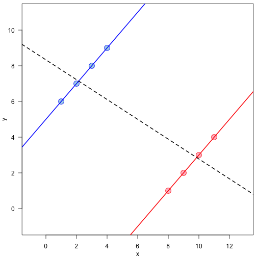

<style>
.small-code pre code {
  font-size: 1em;
}
</style>

simpson-causal-something
========================================================
author: Prasanna Bhogale
date: 07-02-2020
autosize: true

Agenda
========================================================

- We are confused about statistics (and we should remember that)
- We are less confused by the world (and we should be careful with that)
- Computers are awesome (and we should use them)


```r
glue::glue("And we are going to use R. Just because.")
```

```
And we are going to use R. Just because.
```


A simple question : was Berkeley sexist in 1973?
========================================================

|Department| M applicants | M admitted | W applicants | W Admitted |
|:--:|:--------------:|:------------:|:----------------:|:--------------:|
|Total| 8442 | 44% | 4321 | 35% |

**Bad Berkeley !**

A simple question : was Berkeley sexist in 1973?
========================================================

|Department| M applicants | M admitted | W applicants | W Admitted |
|:--:|:--------------:|:------------:|:----------------:|:--------------:|
|Total| 8442 | 44% | 4321 | 35% |

**But hang on..**

|Department| M applicants | M admitted | W applicants | W Admitted |
|:--------:|:--------------:|:------------:|:----------------:|:--------------:|
| A | 825 | 62% | 108 | 82% |
| B | 560 | 63% | 25 | 68% |
| C | 325 | 37% | 593 | 34% |
| D | 417 | 33%	| 375 | 35% |
| E | 191 | 28% | 393 | 24% |
| F | 373 | 6%  | 341 | 7% |

A simple question : was Berkeley sexist in 1973?
========================================================

|Department| M applicants | M admitted | W applicants | W Admitted |
|:--------:|:--------------:|:------------:|:----------------:|:--------------:|
| A | 825 | 62% | 108 | 82% |
| B | 560 | 63% | 25 | 68% |
| C | 325 | 37% | 593 | 34% |
| D | 417 | 33%	| 375 | 35% |
| E | 191 | 28% | 393 | 24% |
| F | 373 | 6%  | 341 | 7% |

<p><small>"If the data are properly pooled, taking into account the autonomy of departmental decision making, thus correcting for the tendency of women to apply to graduate departments that are more difficult for applicants of either sex to enter, there is a small but statistically significant bias in favor of women."</small></p>

https://science.sciencemag.org/content/187/4175/398

=====================================

"properly pooled"
======================================


Another simple question : your kidney stone
=====================================

|     | Treatment A | Treatment B |
|:---:|:-----------:|:-----------:|
| Small stone | Group 1 : 93% (81/87) | Group 2 : 87% (234/270) |
| Large stones | Group 3 : 73% (192/263) | Group 4 : 69% (55/80) | 
| Both | 78% (273/350) | 83% (289/350) |

If you **don't know** the size of your stone, should you go for treatment A, or treatment B ?

Another simple question : your kidney stone
=====================================

|     | Treatment A | Treatment B |
|:---:|:-----------:|:-----------:|
| Small stone | Group 1 : 93% (81/87) | Group 2 : 87% (234/270) |
| Large stones | Group 3 : 73% (192/263) | Group 4 : 69% (55/80) | 
| Both | 78% (273/350) | 83% (289/350) |

And if you **do know** the size of your stone ?

Cartoon Illustration
====================


***

<small>[blog link](https://blog.revolutionanalytics.com/2015/11/fun-with-simpsons-paradox-simulating-confounders.html)</small>


Cartoon Illustration
=======================


***

<small>[blog link](https://blog.revolutionanalytics.com/2015/11/fun-with-simpsons-paradox-simulating-confounders.html)</small>

SN Illustration
======================


Simpson's paradox is about causality
=====================================
left: 30%

***
| Combined | E | $\lnot$ E | Total | Recovery rate |
|:---:|:-----------:|:-----------:|:--:|:--:|
| drug $(C)$ | 20 | 20 | 40 | 50% |
| no-drug $(\lnot C)$ | 16 | 24 | 40 | 40% |
| | 36 | 44 | 80 | |
| Male | E | $\lnot$ E | Total | Recovery rate |
| drug $(C)$ | 18 | 12 | 30 | 60% |
| no-drug $(\lnot C)$ | 7 | 3 | 10 | 70% |
| | 25 | 15 | 40 | |
| Female | E | $\lnot$ E | Total | Recovery rate |
| drug $(C)$ | 2 | 8 | 10 | 20% |
| no-drug $(\lnot C)$ | 9 | 21 | 30 | 30% |
| | 11 | 29 | 40 | |

<small>http://bayes.cs.ucla.edu/R264.pdf</small>

Simpson's paradox is about causality
=====================================
left: 30%

***
| Combined | E | $\lnot$ E | Total | Recovery rate |
|:---:|:-----------:|:-----------:|:--:|:--:|
| drug $(C)$ | 20 | 20 | 40 | 50% |
| no-drug $(\lnot C)$ | 16 | 24 | 40 | 40% |
| | 36 | 44 | 80 | |
| Low BP | E | $\lnot$ E | Total | Recovery rate |
| drug $(C)$ | 18 | 12 | 30 | 60% |
| no-drug $(\lnot C)$ | 7 | 3 | 10 | 70% |
| | 25 | 15 | 40 | |
| High BP | E | $\lnot$ E | Total | Recovery rate |
| drug $(C)$ | 2 | 8 | 10 | 20% |
| no-drug $(\lnot C)$ | 9 | 21 | 30 | 30% |
| | 11 | 29 | 40 | |


<small>http://bayes.cs.ucla.edu/R264.pdf</small>

Simpson's paradox is about causality
=====================================
left: 30%

***
| Combined | E | $\lnot$ E | Total | Recovery rate |
|:---:|:-----------:|:-----------:|:--:|:--:|
| drug $(C)$ | 20 | 20 | 40 | 50% |
| no-drug $(\lnot C)$ | 16 | 24 | 40 | 40% |
| | 36 | 44 | 80 | |
| F-1 | E | $\lnot$ E | Total | Recovery rate |
| drug $(C)$ | 18 | 12 | 30 | 60% |
| no-drug $(\lnot C)$ | 7 | 3 | 10 | 70% |
| | 25 | 15 | 40 | |
| F-2 | E | $\lnot$ E | Total | Recovery rate |
| drug $(C)$ | 2 | 8 | 10 | 20% |
| no-drug $(\lnot C)$ | 9 | 21 | 30 | 30% |
| | 11 | 29 | 40 | |

<small>http://bayes.cs.ucla.edu/R264.pdf</small>


d-seperation
=========================

A path $p$ is blocked by a set of nodes $Z$ if and only if

- $p$ contains a chain of nodes $A\rightarrow B\rightarrow C$ or a fork $A \leftarrow B \rightarrow C$ such that the middle node $B$ is in $Z$ (i.e., $B$ is conditioned on), or
- $p$ contains a collider $A \rightarrow B \leftarrow C$ such that the collision node $B$ is not in $Z$, and no descendant of $B$ is in $Z$

If $Z$ blocks every path between two nodes $X$ and $Y$, then $X$ and $Y$ are d-separated, conditional on $Z$, and thus are independent conditional on $Z$.

[Pearl, Glymour, Jewell](https://www.amazon.de/dp/1119186846/ref=sr_1_3?qid=1581036557&refinements=p_27%3AJudea+Pearl&s=books-intl-de&sr=1-3&text=Judea+Pearl)

The back door criterion
=======================

Given an ordered pair of variables $(X,Y)$ in a directed acyclic graph $G$, a set of variables $Z$ satisfies the backdoor criterion relative to $(X, Y)$ if no node in $Z$ is a descendant of $X$, and $Z$ blocks every path between $X$ and $Y$ that contains an arrow into $X$.
If a set of variables $Z$ satisfies the backdoor criterion for $X$ and $Y$, then the causal effect of $X$ on $Y$ is given by,

$$P(Y = y|do(X = x)) = \sum_z P(Y = y|X = x, Z = z)P(Z = z).$$
Objective :
<small>
- We block all spurious paths between X and Y.  
- We leave all directed paths from X to Y unperturbed.   
- We create no new spurious paths.  

[Pearl, Glymour, Jewell](https://www.amazon.de/dp/1119186846/ref=sr_1_3?qid=1581036557&refinements=p_27%3AJudea+Pearl&s=books-intl-de&sr=1-3&text=Judea+Pearl)
</small>

Revisiting our stories
=======================
left: 30%

***
For the first one, condition on $F$, and for the other two, don't. 

| Combined | E | $\lnot$ E | Total | Recovery rate |
|:---:|:-----------:|:-----------:|:--:|:--:|
| drug $(C)$ | 20 | 20 | 40 | 50% |
| no-drug $(\lnot C)$ | 16 | 24 | 40 | 40% |
| | 36 | 44 | 80 | |
| F-1 | E | $\lnot$ E | Total | Recovery rate |
| drug $(C)$ | 18 | 12 | 30 | 60% |
| no-drug $(\lnot C)$ | 7 | 3 | 10 | 70% |
| | 25 | 15 | 40 | |
| F-2 | E | $\lnot$ E | Total | Recovery rate |
| drug $(C)$ | 2 | 8 | 10 | 20% |
| no-drug $(\lnot C)$ | 9 | 21 | 30 | 30% |
| | 11 | 29 | 40 | |

Statement of Simpson's paradox
==============================

$$P(E|C) > P(E|\lnot C)$$

$$P(E|C,F) < P(E|\lnot C, F)$$

$$P(E|C, \lnot F) < P(E|\lnot C, \lnot F)$$

The sure-thing theorem
---
An action $C$ that increases the probability of an event $E$ in every subpopulation must also increase the probability of $E$ in the population as a whole, provided that the action does not change the distribution of the populations.

$$P(E|do(C),F) < P(E|do(\lnot C), F) \text{ and } \\ P(E|do(C), \lnot F) < P(E|do(\lnot C), \lnot F)$$

$$\implies P(E|do(C)) < P(E|do(\lnot C))$$

<small>http://bayes.cs.ucla.edu/R264.pdf</small>

Sure-thing theorem
====================

If decision to take treatment does not affect gender (the drugs don't change gender),
$$P(F|do(C)) = P(F|do(\lnot C)) = P(F).$$

We can write, 
$$P(E|do(C)) = P(E|do(C),F)P(F|do(C)) + \\
P(E|do(C),\lnot F)P(\lnot F|do(C))$$

$$= P(E|do(C),F)P(F) + P(E|do(C),\lnot F)P(\lnot F).$$

Similarly, 
$$P(E|do(\lnot C)) =P(E|do(\lnot C),F)P(F) + \\
P(E|do(\lnot C),\lnot F)P(\lnot F).$$

therefore, 
$$P(E|do(C)) < P(E|do(\lnot C))$$

<small>http://bayes.cs.ucla.edu/R264.pdf</small>

now, on to computers !
=======================


easy.
=======
class: small-code


```r
g <- dagitty('dag {
    X [pos="0,1"]
    Y [pos="1,1"]
    Z [pos="2,1"]
    W [pos="1,0"]
    T [pos="2,2"]
    
    X -> Y -> Z -> T
    X -> W -> Y -> T
    W -> Z
}')
ancestors( g, "Z" )
```

```
[1] "Z" "Y" "X" "W"
```

```r
paths( g, "X", "T")$paths
```

```
[1] "X -> W -> Y -> T"      "X -> W -> Y -> Z -> T" "X -> W -> Z -> T"     
[4] "X -> W -> Z <- Y -> T" "X -> Y -> T"           "X -> Y -> Z -> T"     
[7] "X -> Y <- W -> Z -> T"
```

```r
paths( g, "X", "T", directed=TRUE )$paths
```

```
[1] "X -> W -> Y -> T"      "X -> W -> Y -> Z -> T" "X -> W -> Z -> T"     
[4] "X -> Y -> T"           "X -> Y -> Z -> T"     
```
dagitty.net/primer

one more
=====
class: small-code


```r
fig2.9 <- dagitty("dag { 
X <- Z1 -> Z3 <- Z2 -> Y
X <- Z3 -> Y
X -> W -> Y
}")
coordinates(fig2.9) <- list(x=c(X=1,W=2,Y=3,Z1=1,Z3=2,Z2=3),
    y=c(X=0,W=0,Y=0,Z2=-2,Z1=-2,Z3=-1))
plot(fig2.9)
```


dagitty.net/primer

also easy (a)
==========
class: code-small

```r
impliedConditionalIndependencies( fig2.9 )
```

```
W _||_ Z1 | X
W _||_ Z2 | Z1, Z3
W _||_ Z2 | X
W _||_ Z3 | X
X _||_ Y | W, Z2, Z3
X _||_ Y | W, Z1, Z3
X _||_ Z2 | Z1, Z3
Y _||_ Z1 | X, Z2, Z3
Y _||_ Z1 | W, Z2, Z3
Z1 _||_ Z2
```

dagitty.net/primer

also easy (b)
==========
class: code-small


```r
latents( fig2.9 ) <- setdiff( names(fig2.9), c("Z3", "W", "X", "Z1") )
impliedConditionalIndependencies( fig2.9 )
```

```
W _||_ Z1 | X
W _||_ Z3 | X
```

dagitty.net/primer

Take home messages
====================

- most interesting questions are about causality
- classical statistics is hard and also terribly incomplete since it is terrified of the word "cause"
- causality is hard to reason about as well, but having a formal language to pin down implicit assumptions about causality helps
- when something is hard to reason about, write down your causal assumptions and see if they can be tested
